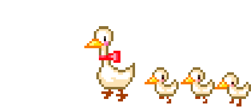
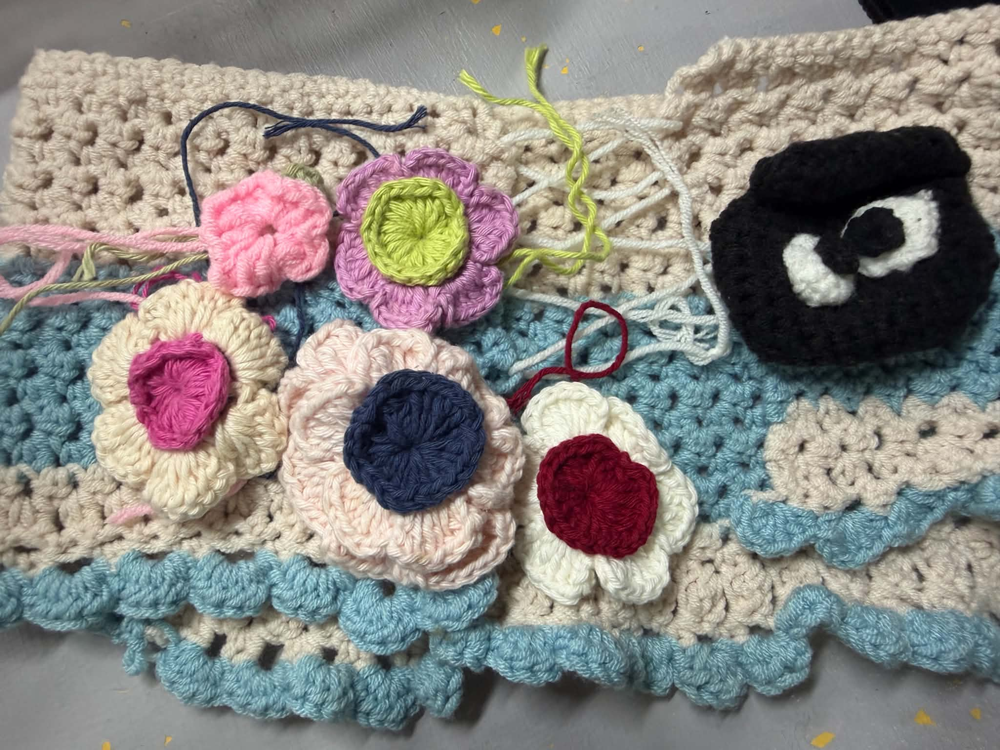

<!-- Banner / Cover -->

  

  

 <em>“Code. Create. Connect across all platforms.”</em>

---

## 🚀 About Me
* 🌍  I'm based in Phayao
* ✉️  You can contact me at [thanidass1234@gmail.com]
* 🎓  I'm an Information Technology (IT) student 
* 💻  Focusing on Web Development, currently learning HTML, CSS, JavaScript, Next.js, and React.js, JAVA
* 🎯  2026 Goal: Build and deploy a complete full-stack web application

---

  

## 🧰 Tech Stack & Tools

| Domain | Technologies & Tools |
|--------|----------------------|
| **Frontend & Mobile** |         |
| **Backend** |   |
| **Database** |     |
| **Design & Tools** |          |
| **AI Tools** |     |

---

 
## 📚 Featured Project Details 💁‍♀️
Project Name: Rabies Prevention and Control Project Management System  Mae Rim Subdistrict Municipality (Rim Tai)
Overview:
A web-based vaccination queue booking system for the Mae Rim village area. The system is developed with three user roles: Admin, VHV (Village Health Volunteer), and Mayor. 
This project covers the web application portion only; 
a teammate is separately developing the companion mobile application.

Roles & Responsibilities:
1. Admin 👩‍💻
 - Create / edit projects (programs)
 - Create / edit appointments (vaccination scheduling)
 - Create / edit staff (officer) information
 - Manage budget and equipment procurement
 - Approve reports submitted by users
 - View review/feedback data
2. VHV (Village Health Volunteer) 🧍‍♀️
 - View and update users' booking information
3. Mayor 🧍‍♂️
 - Approve budgets
 - Approve equipment procurement

| Tech Stack | IDE/Code Editor |
|--------|------------------|
|Frontend:   |   |
|Backend:  |  |
|Database:    |   |

---

  

## Project Example 📔

<table>
<tr>
<td bgcolor="#1e1e2e" align="center">

**🔗 Link**

</td>
</tr>
</table>

**"Scope note: This description covers only the web application portion, which was developed entirely by me. It was built in collaboration with a teammate who was responsible for the mobile application side."**

---

 
## 🏆 Certificates & Activities

- ⟪Sep 2026⟫ • งานบริการสังคม ณ โรงเรียนบ้านบวกค้าง ตำบล: บวกค้าง อ.สันกำแพง จ.เชียงใหม่ (21 ก.ย. 2569)
  > รับผิดชอบในหน้าที่ติดต่อไปทางโรงเรียนประสานงานให้กับเพื่อนในกลุ่มและทางฝั่งโรงเรียนในการร่วมกันจัดกิจกรรม รวมถึงติดต่อการเบิกงบค่าอาหารต่างๆ ได้รับตำแหน่งหน้าที่เป็นเรขานุการ

- ⟪May 2026⟫ • โครงการอบรมเชิงปฏิบัติการเพื่อเพิ่มพูนทักษะด้านการเรียนให้กับนักศึกษาอบรม Agile (7-8 พ.ค. 2569)
  > เข้าร่วมอบรมแล้วนำความรู้ด้าน Agile มาประยุกต์ใช้ในการทำงานร่วมกันเป็นทีม

- ⟪Aug 2025⟫ • Business Model Canvas และการประยุกต์ใช้ AI กับการวางแผนธุรกิจเบื้องต้น (15 ส.ค. 2568)
  > เข้าร่วมฟังอบรม และนำความรู้ไปประยุกต์ใช้ในการทำงานกลุ่มร่วมกับเพื่อนในคาบเรียน วิชา start up

- ⟪Nov 2024⟫ • โครงการพัฒนาศักยภาพเยาวชนทางเทคโนโลยีสารสนเทศ ITCAMP MAEJO (1 พ.ย. 2567)
  > เข้าร่วมกิจกรรมของสาขา รับผิดชอบในส่วนการแนะนำสถานที่ให้แก่ผู้ที่มาเข้าร่วมโครงการของสาขา

- ⟪Nov 2024⟫ • จิตอาสาเพื่อชุมชนและสังคม ณ โรงเรียนบ้านปางเฟือง อ.เชียงดาว จ.เชียงใหม่ (22-23 พ.ย. 2567)
  > เข้าร่วมกิจกรรมของสาขา รับผิดชอบในส่วนการบริการและการดูแล

- ⟪ได้รับเกียรติบัตรใบประกาศนียบัตร รางวัลเรียนดี (2567-2569)

---

## 🎼🏃‍♀️‍➡️📓🖌️ (Hobbies & Interests)

| งานอดิเรก | รายละเอียด | ตัวอย่างผลงาน / สิ่งที่ชอบ |
| :--- | :--- | :--- |
| **🧶 ถักโครเชต์** | เป็นกิจกรรมที่ช่วยฝึกสมาธิและความใจเย็น ชอบถักชิ้นงานน่ารักๆ เช่น เสื้อผ้า รูปทรงเช่นดอกไม้ เคสแอร์พอร์ต ผ้าคลุมตู้เย็น |  |
| **📖 อ่านหนังสือ** | ชอบอ่านหนังสือแนวพัฒนาตนเอง (Self-Improvement) เพื่อสร้างแรงบันดาลใจ และเรียนรู้สิ่งใหม่ไปกับการอ่านหนังสือ   |  |

 
- *📚 หนังสือที่กำลังอ่านอยู่ช่วงนี้: `The Road Less Traveled `*  
- *🎨 งานอดิเรกที่สนใจ เพิ่มในช่วงนี้: `ฝึกออกแบบหน้าเว็ป , ทบทวนและเรียนรู้โค้ดในส่วนที่อยากพัฒนา `*
  

---

  

## 🤝 Let’s Connect
- 📧 Email: **Thanidass1234@gmail.com**  
- 💬 Line ID: **qyyyyyyyp**
- 💬 Facebook: **Thanida  Wiangkham**
- 📞 Phone number: **0972308592**
- ### Socials

 <a href="https://www.github.com/thanidass" target="_blank" rel="noreferrer"> <picture> <source media="(prefers-color-scheme: dark)" srcset="https://raw.githubusercontent.com/danielcranney/readme-generator/main/public/icons/socials/github-dark.svg" /> <source media="(prefers-color-scheme: light)" srcset="https://raw.githubusercontent.com/danielcranney/readme-generator/main/public/icons/socials/github.svg" />  </picture> </a>  <a href="https://www.facebook.com/Thanida Wiangkham" target="_blank" rel="noreferrer"> <picture> <source media="(prefers-color-scheme: dark)" srcset="https://raw.githubusercontent.com/danielcranney/readme-generator/main/public/icons/socials/facebook-dark.svg" /> <source media="(prefers-color-scheme: light)" srcset="https://raw.githubusercontent.com/danielcranney/readme-generator/main/public/icons/socials/facebook.svg" />  </picture> </a>

 

  

